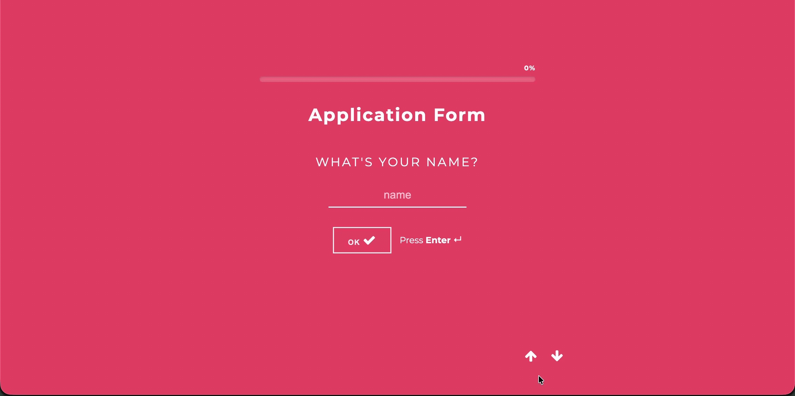

# Application Form

A sleek, user-friendly multi-step application form inspired by the "Typeform" experience. Users navigate through questions one at a time using mouse or keyboard shortcuts, with animated transitions and a dynamic progress bar.

---

## 🚀 Live Demo

View the working implementation here: [CodePen Demo](https://codepen.io/abi_j07/pen/BaQYMMd)

---

## 🖼️ Screenshots

| Demo                                        |
| ------------------------------------------- |
|  |

---

## ✨ Features

- **Single-Question Focus:** Only one question is visible at a time, reducing cognitive load.
- **Animated Transitions:** Smooth slide-in/slide-out animations between steps.
- **Dynamic Progress Bar:** Visual feedback on completion percentage at the top.
- **Keyboard & Button Navigation:** Use Enter, up/down arrows, or on-screen buttons to move between steps.
- **Regex Validation:**
  - Email: Validates standard email format.
  - Phone: Accepts 10-15 digit numbers.
  - Age: Must be between 18 and 120.
  - All fields required; address validated on submit.
- **Error Feedback:** Invalid input triggers a shake animation and error message.
- **Success & Summary Screen:** Displays a thank you message and summary after submission.
- **Responsive Design:** Works seamlessly on desktop and mobile devices.
- **FontAwesome Icons:** For navigation and feedback.

---

## 🛠️ Technologies Used

- **HTML5:** Semantic structure and form elements
- **CSS3:** Styling, transitions, and responsive design
- **JavaScript (Vanilla):** DOM manipulation, validation, navigation, progress logic
- **FontAwesome:** Icons for navigation arrows and checkmarks

---

## 📂 Project Structure

- `index.html`: Form markup, progress bar, and summary screen
- `main.js`: Navigation, validation, transitions, progress bar, and summary logic
- `main.css`: Layout, transitions, shake animation, and responsive styles
- `screenshots/`: Place your desktop.png and mobile.png screenshots here

---

## 💡 How It Works

The form toggles a CSS class called `.is-visible` to show/hide each step. Transitions use slide-in/slide-out animations. The progress bar updates as you advance. Validation is performed on each step, with regex for email/phone and range for age. Errors trigger a shake animation. On submit, a summary and thank you message are shown.

### Logic Flow

1. **Initial State:** Only the name field is visible.
2. **Step Navigation:**
   - Next: Enter key, down arrow, or OK button
   - Previous: Up arrow or back button
3. **Validation:**
   - Each step validates input before proceeding
   - Email, phone, and age have specific validation rules
   - Address is validated on submit
4. **Progress Bar:** Updates after each valid step
5. **Success:** Shows a summary and thank you message

---

## ⚙️ Setup

1. Clone the repository or copy the code files.
2. Ensure you have an active internet connection to load the FontAwesome stylesheet from the CDN.
3. Place screenshots in the `screenshots/` folder (optional).
4. Open `index.html` in any modern web browser.
